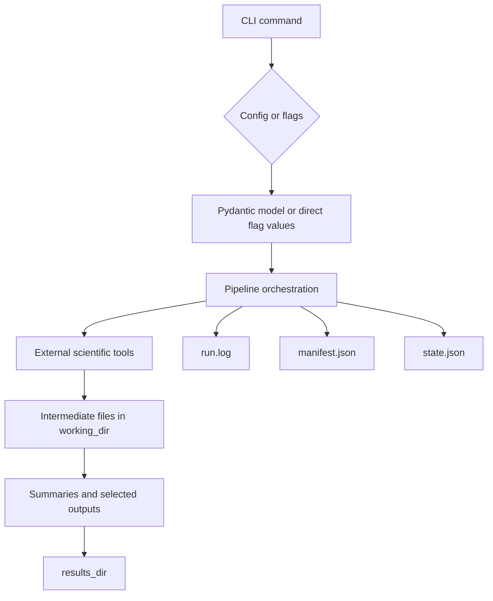
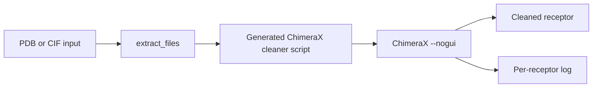
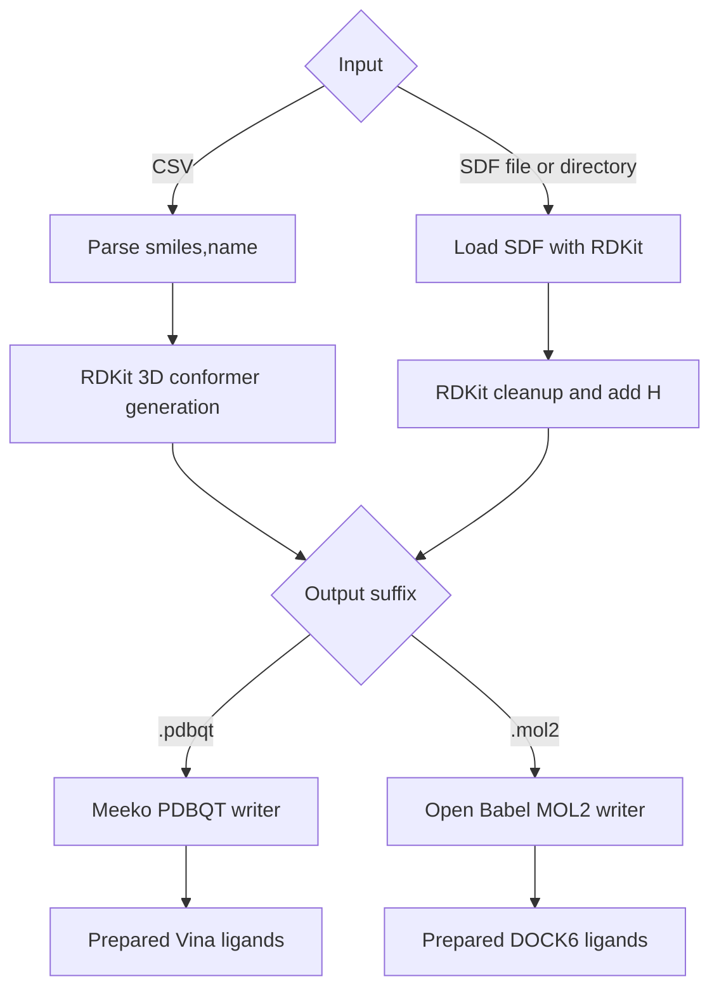
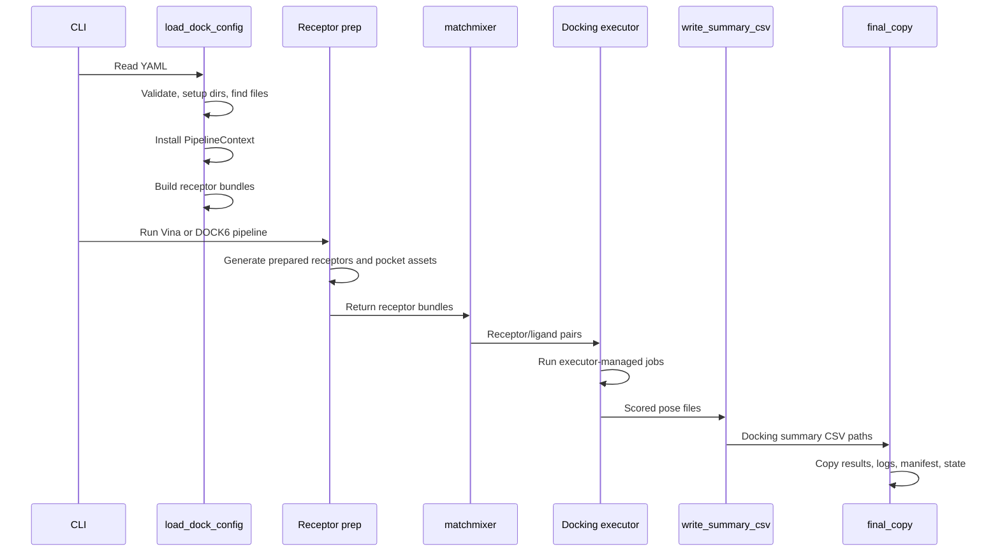
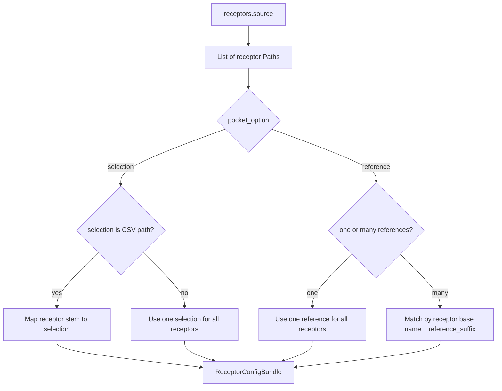
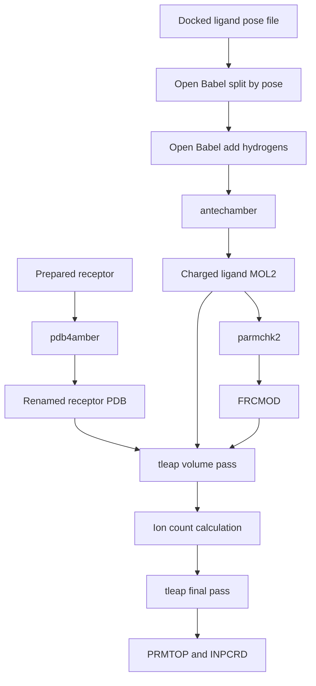
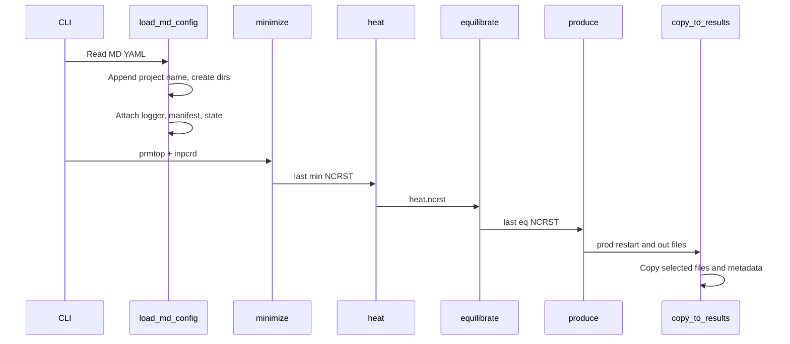

# Data Flow

This document describes how data enters NexusMol, how it is transformed, and where outputs are written in the current implementation.

## High-Level Lifecycle



The CLI starts each run. Config loaders create typed config objects, then pipelines resolve files, install the global `PipelineContext`, launch tools, parse outputs, and copy final artifacts into results directories.

## Fetch Data Path

Input:

- PDB IDs from repeated `-i/--input` flags.
- Or a text file path passed through `-i`, with one PDB ID per line.

Processing:

1. `FetchPipeline.run()` converts input into a list of IDs.
2. `rcsb_fetch()` queries RCSB nonpolymer entities.
3. Common solvent, ions, and crystallization agents are filtered out.
4. Each remaining ligand is downloaded as SDF.
5. The biological assembly is downloaded as CIF.

Output:

```text
<output_dir>/<PDB_ID>.cif
<output_dir>/<PDB_ID>_<LIGAND>.sdf
```

Ligand download failures are printed and the command continues to the assembly download. Missing or empty assembly files raise exceptions.

## Preparation Data Paths

### Receptor Cleaning



`nexus prep rec` accepts a file or directory. Directory input is scanned for `.pdb` and `.cif`. The pipeline creates a short ChimeraX Python script from `_clean_template.py`, runs it, deletes the temporary script, and logs chain/protonation information.

Output:

```text
<output_dir>/<input_stem><suffix>
<output_dir>/<input_stem><suffix_without_extension>.log
```

### Receptor Mutation

Input mutation strings use:

```text
selection-NEW_RES
```

Processing:

1. `MutatePipeline` splits each mutation string on `-`.
2. `chimerax_mutate()` builds ChimeraX stdin commands.
3. ChimeraX selects the residue, deletes hydrogens, assigns the residue name, adds hydrogens/charges, and saves the receptor.
4. ChimeraX stdout is parsed for empty selections and assigned residue names.

Output:

```text
<output_dir>/<input_stem><suffix>
<output_dir>/<input_stem><suffix_without_extension>.log
```

### Ligand Docking Preparation



CSV input is validated strictly:

- Header must be exactly `smiles,name`.
- SMILES values cannot be empty or duplicated.
- Ligand names are sanitized for filenames and cannot collide after sanitization.

SDF input can be a file or directory. Directory input is searched recursively for `.sdf`.

Output:

```text
<output_dir>/<ligand_name>_prepared.pdbqt
<output_dir>/<ligand_name>_prepared.mol2
```

When `skip=True` is used by the Python parallel executor, failed ligand tasks are logged and filtered out of downstream results. The surviving molecules can be misaligned with the original names list when a task fails.

## Docking Data Path



### Configuration Resolution

Input YAML:

- `libs`
- `common`
- `receptors`
- `ligands`
- `vina` or `dock6`

`load_dock_config()` transforms raw YAML into runtime config:

1. Validates fields with `DockConfig`.
2. Appends `project_name` to working/results directories.
3. Creates logger, manifest, and state objects.
4. Extracts receptor and ligand files from files, directories, or lists.
5. Resolves receptor pocket definitions into `ReceptorConfigBundle` objects.

### Receptor Bundle States



Each bundle carries:

- `receptor`
- `name`
- `selection_string` or `reference_path`

### Vina-Specific Flow

1. ChimeraX creates a pocket PDB.
2. `mk_prepare_receptor.py` writes receptor PDBQT and a Vina config with box parameters.
3. NexusMol appends `exhaustiveness`, `num_modes`, and `cpu = 1`.
4. The docking executor runs `vina` for each receptor/ligand pair.
5. `write_summary_csv()` parses `REMARK VINA RESULT` lines.
6. `final_copy()` copies pose files, receptor files, pockets, summaries, and run metadata.

### DOCK6-Specific Flow

1. ChimeraX writes receptor MOL2 files and a pocket MOL2 file.
2. Legacy Chimera writes a DMS surface file.
3. DOCK6 utilities generate spheres and grids.
4. NexusMol writes flex input files.
5. The docking executor runs `dock6`.
6. `write_summary_csv()` parses `Grid_Score` lines.
7. `final_copy()` copies selected outputs and run metadata.

## SysMD Data Path



Input:

- `common.input`: receptor file.
- `sysmd.ligand`: prepared ligand pose file.
- `sysmd.pose_num`: pose index.

Output:

```text
<output_dir>/<system_name>/<system_name>.prmtop
<output_dir>/<system_name>/<system_name>.inpcrd
```

The current code treats `ligand` as optional in the schema, but receptor-only runs still have a known `None` handling issue in `tleap` command construction.

## Amber MD Data Path



Each Amber stage renders an input file in the working directory and calls `pmemd.cuda`.

Working outputs include:

```text
min*.in / min*.out / min*.ncrst / min*.nc / min*.info
heat.in / heat.out / heat.ncrst / heat.nc / heat.info
eq*.in / eq*.out / eq*.ncrst / eq*.nc / eq*.info
seed*.in / seed*.out / seed*.ncrst / seed*.nc / seed*.info
prod*.in / prod*.out / prod*.ncrst / prod*.nc / prod*.info
```

Current result copying includes the input topology, production restart files, production output logs, and run metadata. Production trajectory files remain in the working directory.

## MD Analysis Data Path

Input:

- `--prmtop`
- `--trajin`
- `--mask`
- optional `--name`
- optional `--output-dir`

Processing:

1. `full_analyze()` checks `AMBERHOME`.
2. It renders `analysis_template.txt`.
3. `_run_cpptraj()` writes `<name>.in` and runs `cpptraj`.
4. A notebook template is copied to `Visual_<name>.ipynb`.

Output:

- CPPTRAJ input file.
- RMSD/RMSF outputs.
- Hydrogen-bond outputs.
- Secondary-structure outputs.
- PCA outputs.
- Clustering outputs.
- Visualization notebook.

## Error Handling Along the Data Path

| Stage | Failure behavior |
| --- | --- |
| YAML parsing / Pydantic validation | Raises immediately before pipeline execution. |
| File extraction | Raises `FileNotFoundError`, `TypeError`, or `ValueError` for missing or incompatible input. |
| Pipeline prechecks | Raise explicit errors for unsupported suffixes, missing `AMBERHOME`, missing `dock_home`, or missing required files. |
| `shell()` executor | Logs command, stdout/stderr, raises on non-zero exit. |
| `python_parallel(skip=False)` | Raises the first task exception. |
| `python_parallel(skip=True)` | Logs task errors and filters failed results. |
| `main_tracker()` | Marks stage failed in `state.json`, records exception in `manifest.json`, finalizes manifest as failed, logs stack trace, and re-raises. |
| Fetch ligand downloads | Individual ligand download failures are printed and skipped. |
| Fetch assembly downloads | Missing or empty assembly files raise exceptions. |
| Validation commands | Return immediately without running validation. |

## Persistent Runtime State

For docking and MD pipelines, every tracked run writes:

```text
run.log
manifest.json
state.json
```

`manifest.json` records stage statuses, timing, host/platform, Python version, final status, and errors. `state.json` records stage status and optional serialized outputs. These files are copied from the working directory to the results directory at the end of successful docking and MD runs.
