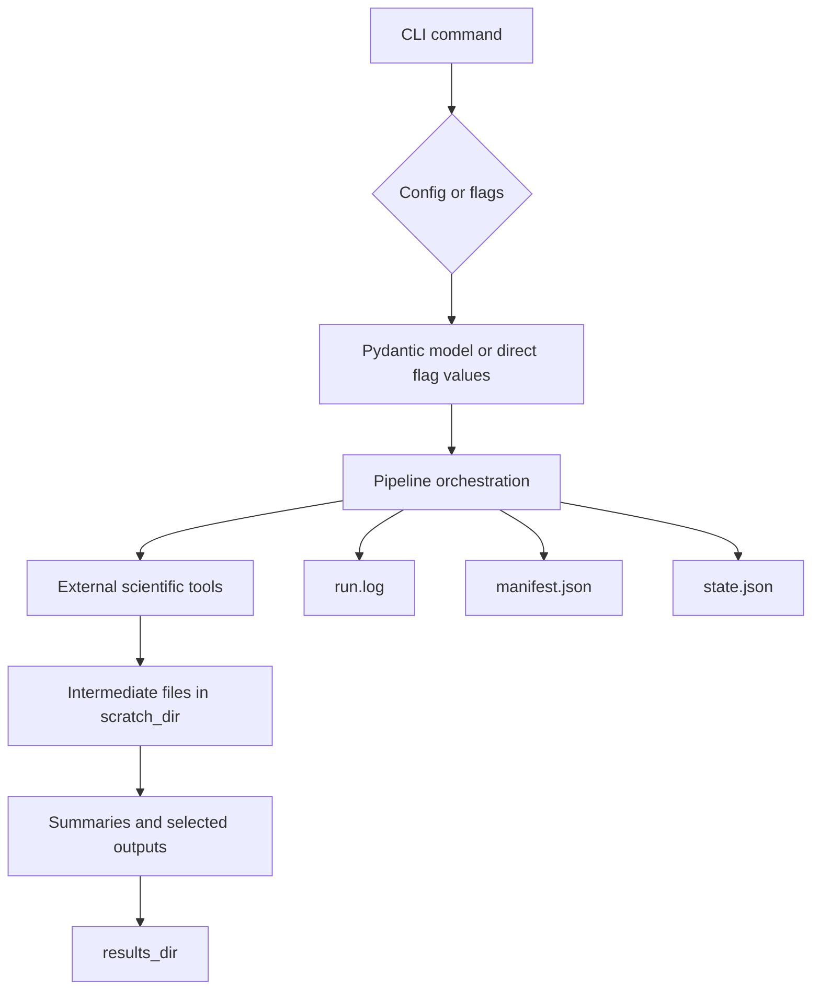
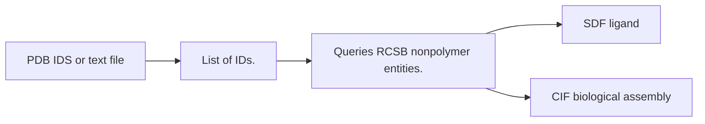
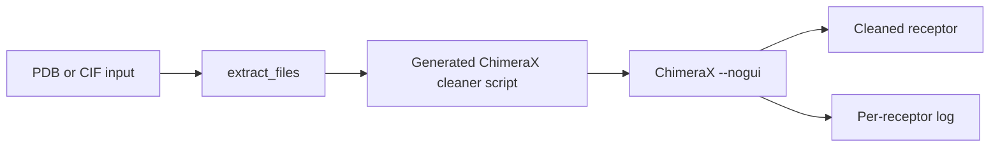
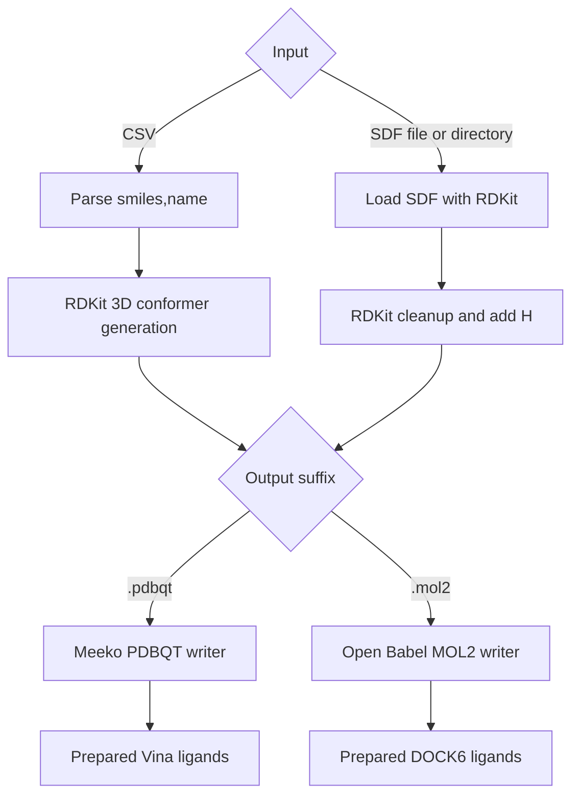
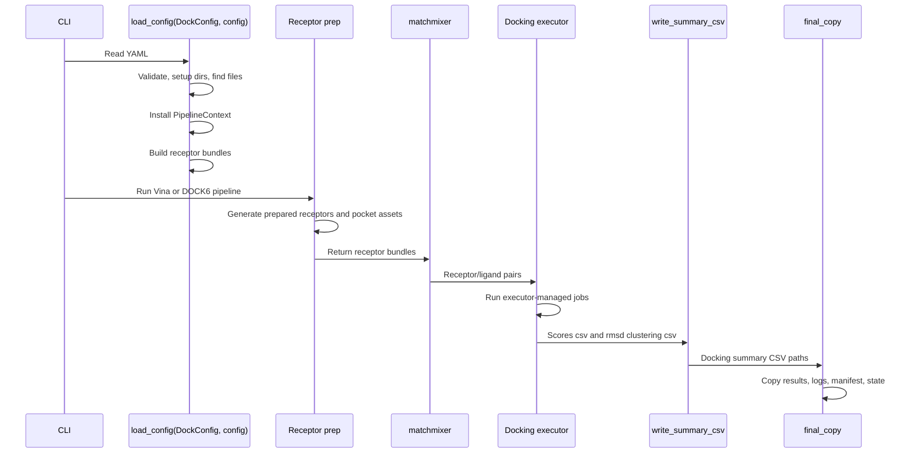
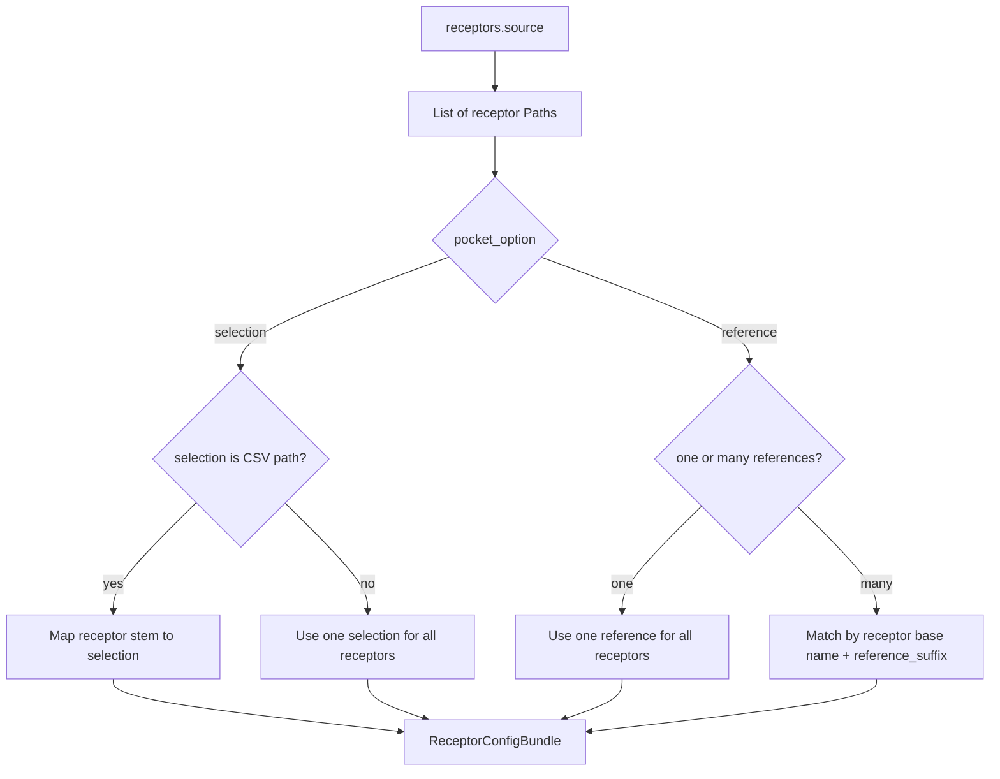
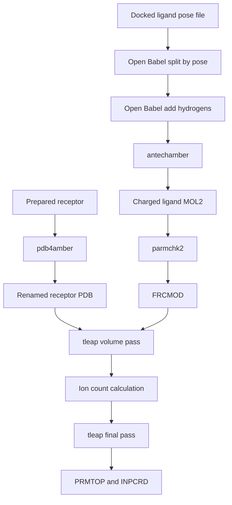
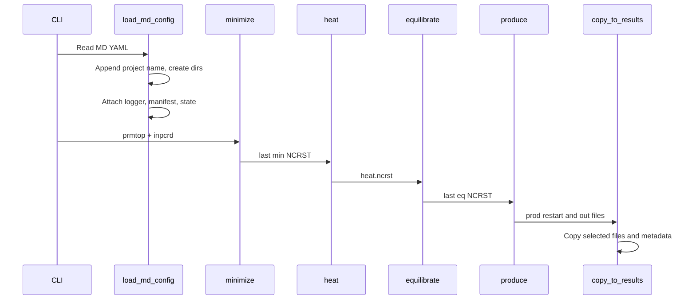

# Data Flow

This document describes how data enters NexusMol, how it is transformed, and where outputs are written in the current implementation.

## High-Level Lifecycle


```mermaid
flowchart TD
    A[CLI command] --> B{Config or flags}
    B --> C[Pydantic model or direct flag values]
    C --> D[Pipeline orchestration]
    D --> E[External scientific tools]
    E --> F[Intermediate files in scratch_dir]
    F --> G[Summaries and selected outputs]
    G --> H[results_dir]
    D --> I[run.log]
    D --> J[manifest.json]
    D --> K[state.json]
```

Tracked jobs use:

```text
<global scratch_dir>/<job_name>/
<common.output_dir>/<job_name>/
```

Fetch and prep commands usually write directly to their requested output directory and do not use job tracking unless they are part of a larger tracked workflow.

## Fetch

Input:

- PDB IDs from repeated `-i/--input` flags.
- Or a text file path passed through `-i`, with one PDB ID per line.

Processing:


```mermaid
flowchart LR
    A[PDB IDS or text file] --> B[List of IDs.]
    B --> C[Queries RCSB nonpolymer entities.]
    C --> D[SDF ligand]
    C --> E[CIF biological assembly]
```

Output:

```text
<output_dir>/<PDB_ID>.cif
<output_dir>/<PDB_ID>_<LIGAND>.sdf
```

Ligand download failures are printed and the command continues to the assembly download. Missing or empty assembly files raise exceptions.

## Receptor Prep

Input can be one `.pdb`/`.cif` file or a directory scanned for `.pdb` and `.cif`.

Processing:


```mermaid
flowchart LR
    A[PDB or CIF input] --> B[extract_files]
    B --> C[Generated ChimeraX cleaner script]
    C --> D[ChimeraX --nogui]
    D --> E[Cleaned receptor]
    D --> F[Per-receptor log]
```

Outputs:

```text
receptors/cleaned/<stem>_cleaned.pdb
receptors/cleaned/<stem>_cleaned.log
```

## Mutation and Protonation

Command:

```bash
nexus prep mutate -i receptors/cleaned/7K40_cleaned.pdb -o receptors/mutated -s "_mutated.pdb" -m ":41-HIP" -m ":145-CYM"
```

Processing:

1. `MutatePipeline` splits each mutation string on `-`.
2. `chimerax_mutate()` builds ChimeraX stdin commands.
3. ChimeraX selects the residue, deletes hydrogens, assigns the residue name, adds hydrogens/charges, and saves the receptor.
4. Nexus rewrites Amber protonation residue labels such as `HIP` or `CYM` back to standard PDB residue names while preserving added hydrogens.

Outputs:

```text
receptors/mutated/<stem>_mutated.pdb
receptors/mutated/<stem>_mutated.log
```

## Ligand Prep

CSV input is validated strictly:

- Header must be exactly `smiles,name`.
- SMILES values cannot be empty or duplicated.
- Ligand names are sanitized for filenames and cannot collide after sanitization.

SDF input can be a file or directory. Directory input is searched recursively for `.sdf`.

Processing:


```mermaid
flowchart TD
    A{Input} -->|CSV| B[Parse smiles,name]
    A -->|SDF file or directory| C[Load SDF with RDKit]
    B --> D[RDKit 3D conformer generation]
    C --> E[RDKit cleanup and add H]
    D --> F{Output suffix}
    E --> F
    F -->|.pdbqt| G[Meeko PDBQT writer]
    F -->|.mol2| H[Open Babel MOL2 writer]
    G --> I[Prepared Vina ligands]
    H --> J[Prepared DOCK6 ligands]
```

Output suffix decides format:

```text
<output_dir>/<ligand_name>_prepared.pdbqt
<output_dir>/<ligand_name>_prepared.mol2
```

When `skip=True` is used by the Python parallel executor, failed ligand tasks are logged and filtered out of downstream results. The surviving molecules can be misaligned with the original names list when a task fails.

## Docking

Input config:

- `common.job_name`, `common.output_dir`, `common.padding`, `common.n_jobs`, `common.max_poses`
- `receptors.source`, `receptors.suffix`, pocket definition
- `ligands.source`, `ligands.suffix`
- `engine.program`
- optional `metadata`

Processing:


```mermaid
sequenceDiagram
    participant CLI
    participant Config as load_config(DockConfig, config)
    participant Prep as Receptor prep
    participant Pair as matchmixer
    participant Dock as Docking executor
    participant Summary as write_summary_csv
    participant Copy as final_copy

    CLI->>Config: Read YAML
    Config->>Config: Validate, setup dirs, find files
    Config->>Config: Install PipelineContext
    Config->>Config: Build receptor bundles
    CLI->>Prep: Run Vina or DOCK6 pipeline
    Prep->>Prep: Generate prepared receptors and pocket assets
    Prep->>Pair: Return receptor bundles
    Pair->>Dock: Receptor/ligand pairs
    Dock->>Dock: Run executor-managed jobs
    Dock->>Summary: Scores csv and rmsd clustering csv
    Summary->>Copy: Docking summary CSV paths
    Copy->>Copy: Copy results, logs, manifest, state
```

### Receptor Bundle States


```mermaid
flowchart TD
    A[receptors.source] --> B[List of receptor Paths]
    B --> C{pocket_option}
    C -->|selection| D{selection is CSV path?}
    D -->|yes| E[Map receptor stem to selection]
    D -->|no| F[Use one selection for all receptors]
    C -->|reference| G{one or many references?}
    G -->|one| H[Use one reference for all receptors]
    G -->|many| I[Match by receptor base name + reference_suffix]
    E --> J[ReceptorConfigBundle]
    F --> J
    H --> J
    I --> J
```

Each bundle carries:

- `receptor`
- `name`
- `selection_string` or `reference_path`

### Vina-Specific Flow

1. ChimeraX creates a pocket PDB.
2. `mk_prepare_receptor.py` writes receptor PDBQT and a Vina config with box parameters.
3. NexusMol appends `exhaustiveness`, `num_modes`, and `cpu = 1`.
4. The docking executor runs `vina` for each receptor/ligand pair.
5. `write_summary_csv()` parses `REMARK VINA RESULT` lines.
6. `final_copy()` copies pose files, receptor files, pockets, summaries, and run metadata.

### DOCK6-Specific Flow

1. ChimeraX writes receptor MOL2 files and a pocket MOL2 file.
2. Legacy Chimera writes a DMS surface file.
3. DOCK6 utilities generate spheres and grids.
4. NexusMol writes flex input files.
5. The docking executor runs `dock6`.
6. `write_summary_csv()` parses `Grid_Score` lines.
7. `final_copy()` copies selected outputs and run metadata.

Vina outputs use `.pdbqt` poses and `REMARK VINA RESULT` score parsing.

DOCK6 outputs use `.mol2` poses and `Grid_Score` parsing.

Results:

```text
results/<job_name>/<receptor>/
  <receptor input copy>
  <pocket file>
  Scores_<job_name>_<receptor>.csv
  Clusters_<job_name>_<receptor>.csv
  poses/
    <receptor>_<ligand>_scored.pdbqt
```

The metadata JSON is written at:

```text
results/<job_name>/<job_name>_metadata.json
```

## MD Build

Inputs:

- Receptor PDB.
- Optional docked ligand pose file.
- Optional pose index.
- Force-field, water, box, and salt settings.

Processing:


```mermaid
flowchart TD
    A[Prepared receptor] --> B[pdb4amber]
    B --> C[Renamed receptor PDB]
    D[Docked ligand pose file] --> E[Open Babel split by pose]
    E --> F[Open Babel add hydrogens]
    F --> G[antechamber]
    G --> H[Charged ligand MOL2]
    H --> I[parmchk2]
    I --> J[FRCMOD]
    C --> K[tleap volume pass]
    J --> K
    K --> L[Ion count calculation]
    L --> M[tleap final pass]
    M --> N[PRMTOP and INPCRD]
```

Outputs:

```text
results/<job_name>/<job_name>.prmtop
results/<job_name>/<job_name>.inpcrd
results/<job_name>/<job_name>.pdb
```

## MD Run

Command:

```bash
nexus md run -c configs/amber_config.yaml
nexus md run -c configs/openmm_config.yaml
```

Inputs:

- `common.prmtop`
- `common.inpcrd`
- `common.mask`
- timing/restraint sections
- `engine.program: amber` or `openmm`

Amber Data Path


```mermaid
sequenceDiagram
    participant CLI
    participant Config as load_md_config
    participant Min as minimize
    participant Heat as heat
    participant Eq as equilibrate
    participant Prod as produce
    participant Copy as copy_to_results

    CLI->>Config: Read MD YAML
    Config->>Config: Append project name, create dirs
    Config->>Config: Attach logger, manifest, state
    CLI->>Min: prmtop + inpcrd
    Min->>Heat: last min NCRST
    Heat->>Eq: heat.ncrst
    Eq->>Prod: last eq NCRST
    Prod->>Copy: prod restart and out files
    Copy->>Copy: Copy selected files and metadata
```

Each Amber stage renders an input file in the working directory and calls `pmemd.cuda`.

Working outputs include:

```text
min*.in / min*.out / min*.ncrst / min*.nc / min*.info
heat.in / heat.out / heat.ncrst / heat.nc / heat.info
eq*.in / eq*.out / eq*.ncrst / eq*.nc / eq*.info
seed*.in / seed*.out / seed*.ncrst / seed*.nc / seed*.info
prod*.in / prod*.out / prod*.ncrst / prod*.nc / prod*.info
```

OpenMM Data Path is similar but passes the `simulation` object sequentially instead of intermediate files.

Results:

```text
results/<job_name>/
  <input topology>
  prod*.nc or prod*.dcd
  prod*.ncrst or prod*.chk
  prod*.out or prod*.log
  <job_name>_run.log
  <job_name>_manifest.json
  <job_name>_state.json
```

## MD Analyze

Command:

Inputs:

- Topology (`common.prmtop`)
- Trajectory (`common.trajin`)
- Mask (`common.mask`)

Processing:

1. `full_analyze()` checks `AMBERHOME`.
2. It renders `analysis_template.txt`.
3. `_run_cpptraj()` writes `<name>.in` and runs `cpptraj`.
4. A notebook template is copied to `Visual_<name>.ipynb`.

Output:

- CPPTRAJ input file.
- RMSD/RMSF outputs.
- Hydrogen-bond outputs.
- Secondary-structure outputs.
- PCA outputs.
- Clustering outputs.
- Visualization notebook.

The `trajectory` booleans are present in the config model but are not used yet to enable or disable specific template sections.

## MM-PBSA/GBSA

`nexus md mmpbsa` is visible in help output and has a config model, but the current runner needs implementation review before it should be used as a stable workflow.

## Error Handling Along the Data Path

| Stage | Failure behavior |
| --- | --- |
| YAML parsing / Pydantic validation | Raises immediately before pipeline execution. |
| File extraction | Raises `FileNotFoundError`, `TypeError`, or `ValueError` for missing or incompatible input. |
| Pipeline prechecks | Raise explicit errors for unsupported suffixes, missing `AMBERHOME`, missing `dock_home`, or missing required files. |
| `shell()` executor | Logs command, stdout/stderr, raises on non-zero exit. |
| `python_parallel(skip=False)` | Raises the first task exception. |
| `python_parallel(skip=True)` | Logs task errors and filters failed results. |
| `main_tracker()` | Marks stage failed in `state.json`, records exception in `manifest.json`, finalizes manifest as failed, logs stack trace, and re-raises. |
| Fetch ligand downloads | Individual ligand download failures are printed and skipped. |
| Fetch assembly downloads | Missing or empty assembly files raise exceptions. |

## Persistent Runtime State

For docking and MD pipelines, every tracked run writes:

```text
run.log
manifest.json
state.json
```

`manifest.json` records stage statuses, timing, host/platform, Python version, final status, and errors. `state.json` records stage status and optional serialized outputs. These files are copied from the working directory to the results directory at the end of successful docking and MD runs.
